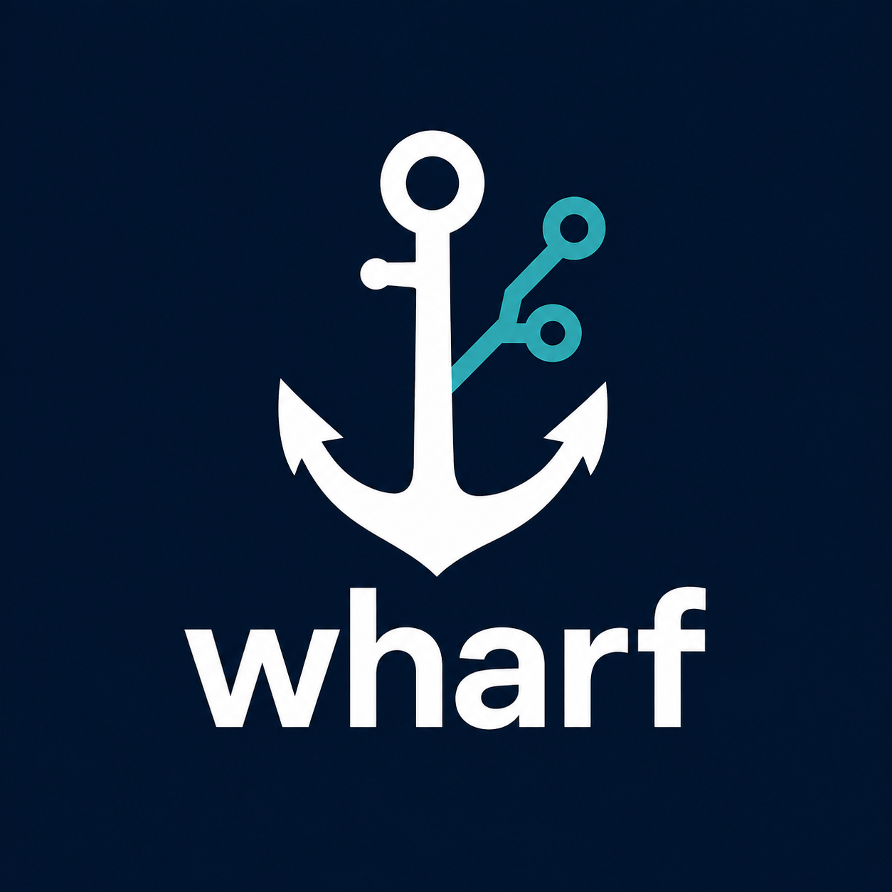

<p align="center">
  
</p>

# wharf

Deploy-as-code for docker compose projects over SSH. no container registry
required.

wharf pushes your project's source straight to each target host over git
(the same trick Heroku-style `git push` deploys use), builds the image
*on* the target with `docker compose build`, and starts it. There's no
registry to run, pay for, or keep patched: the target already has
everything it needs to build the image itself.

A single YAML file describes an environment: where the git remote lives
on each target, which compose file to run, an optional secrets source,
and an ordered list of targets to roll out to sequentially. wharf reads
that file and does the rest, identically whether you run it from your
own machine or from a CI job.

## Install

wharf isn't published to PyPI yet. Install straight from git, pinned to
a tag:

```bash
uvx --from git+https://github.com/alessandropolverino/wharf.git@v0.2.0 wharf --help

# or, into a virtualenv:
pip install "wharf @ git+https://github.com/alessandropolverino/wharf.git@v0.2.0"

# or, as a standalone global tool (recommended for actual use):
uv tool install --from git+https://github.com/alessandropolverino/wharf.git@v0.2.0 wharf
```

Requires `git` and `docker compose` on the machine you deploy *to*;
`git` and `ssh` on the machine you deploy *from* (SSH is only needed for
deploying to your targets, not for installing wharf itself).

## Quickstart

```bash
# one-time per environment: generate a deploy key, create bare repos,
# authorize the key on each target
wharf setup deploy.yml

# add the printed private key as your CI's DEPLOY_SSH_KEY secret,
# then deploy from anywhere:
wharf deploy deploy.yml

# see what a config would do, without touching anything:
wharf ls deploy.yml

# stop everything (optionally wiping volumes):
wharf down deploy.yml --volumes

# restart without rebuilding (e.g. after rotating a secret):
wharf reload deploy.yml
```

Run the exact same `wharf deploy deploy.yml` from a GitHub Actions
workflow, see [docs/configuration.md](docs/configuration.md#running-from-ci)
for the full setup-key-to-workflow walkthrough.

See [docs/how-it-works.md](docs/how-it-works.md) for the architecture
and how wharf extends `docker compose`, or [docs/](docs/README.md) for
the full docs index (config reference + per-file code reference).

## Commands

| Command | What it does |
|---|---|
| `wharf deploy <config.yml>` | Push the current revision, build, and start each target in order. |
| `wharf down <config.yml> [--volumes]` | Stop each target; `--volumes` also removes its volumes. |
| `wharf reload <config.yml>` | Re-run compose without rebuilding, picks up rotated secrets or just restarts. |
| `wharf ls <config.yml>` | List a config's targets and their order, without connecting to anything. |
| `wharf setup <config.yml>` | Bootstrap: generate a deploy keypair, create bare repos, authorize the key. |
| `wharf rotate <config.yml>` | Replace an identity's deploy key everywhere, removing the old `authorized_keys` entry. |
| `wharf identities` | List locally known deploy-key identities and their key files (local only). |

All commands except `ls` and `identities` accept `--only NAME`
(repeatable) to act on a subset of targets, `--repo NAME` to override
the inferred project name, and `--identity NAME` to pick which named
deploy-key identity to use (default: `ci` in CI, `default` otherwise).
`deploy` also accepts `--revision SHA`. See
[docs/configuration.md](docs/configuration.md) for the full config
reference, worked examples, identities and rotation, and how local vs.
CI auth is handled.

Every command checks GitHub for a newer release first (skipped in CI,
or anywhere with `WHARF_NO_UPDATE_CHECK` set) and prints a one-line
notice if one exists -- it never downloads or installs anything on its
own.

## Design notes

- **The compose file is the source of truth.** wharf never generates or
  edits it. It only ever runs `docker compose -f <file> {up|down|run}`
  against whatever's committed in your repo -- `run` only happens for
  services explicitly listed in a target's `pre_up`.
- **No per-project deploy script.** The up/down/reload logic (locking,
  checkout, secrets injection, image cleanup) is built into wharf itself
  and driven entirely by the config file, so there's nothing to keep in
  sync across projects.
- **Config files are flat.** There's no `production:`/`staging:` wrapper
  key, the filename (`deploy.yml`, `deploy.staging.yml`, ...) is what
  tells you which environment a file represents.
