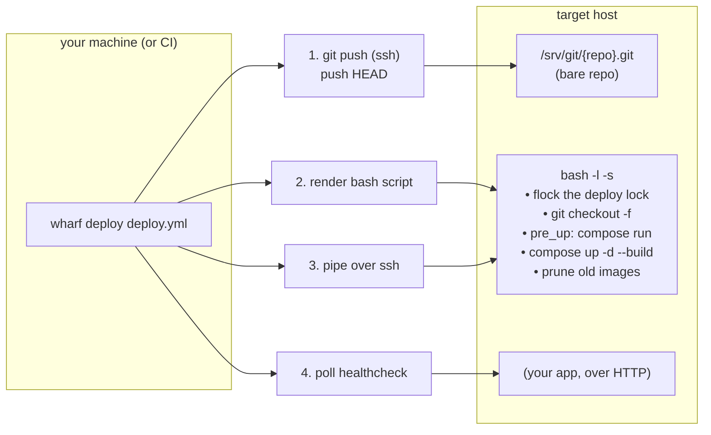

# How wharf works

wharf is an orchestrator *around* `docker compose`, not a replacement for
it. It never generates, edits, or replaces your compose file. Every
container ever started on a target is started by `docker compose`
itself, exactly as if you'd run it by hand. What wharf adds is
everything **around** that call: getting your code onto the target
without a registry, doing it to multiple hosts in the right order, and
wrapping the compose invocation with locking, migrations, secrets, and
cleanup.
## The end-to-end flow

1. **[`operations.deploy`](../src/wharf/operations.md)** resolves auth
   ([`ssh.SessionAuth`](../src/wharf/ssh.md)) and, for each target in
   `order`:
2. **[`git_ops.push_revision`](../src/wharf/git_ops.md)** pushes the current
   revision to a bare git repo on the target. This is what stands in
   for a container registry.
3. **[`remote_script.render_up`](../src/wharf/remote_script.md)** builds a
   complete bash script (checkout, `pre_up`, `up --build`, image
   cleanup), and **[`ssh.run_remote_script`](../src/wharf/ssh.md)** pipes it
   into a single `ssh ... bash -l -s` call.
4. If the target declares `healthcheck`,
   **[`healthcheck.wait_healthy`](../src/wharf/healthcheck.md)** polls it
   from wherever wharf is running (not from the target).

`down` and `reload` follow the same shape minus the parts they don't
need. `down` skips the push/checkout/healthcheck entirely, `reload`
skips the push and `pre_up` (nothing new to migrate if no new revision
was checked out).

## No registry — git *is* the delivery mechanism

The classic compose deploy needs a registry: build an image, push it,
pull it on the target, `docker compose up`. wharf skips the registry
entirely: the same trick Heroku-style `git push` deploys use:

- Each target has a **bare git repo** (`remote_repo`, created once by
  `wharf setup`).
- `wharf deploy` `git push`es the exact revision being deployed straight
  to it, over SSH.
- The remote script then `git checkout -f`s that revision into
  `remote_dir` and runs `docker compose build` **on the target itself**.

Nothing is ever pushed or pulled as an image. This means there's no
registry to run, pay for, or keep patched. The target already has
everything it needs to build the image itself, the same way it would if
you'd cloned the repo there by hand.

## What wharf adds on top of `docker compose`

| Compose alone | wharf adds |
|---|---|
| You run `docker compose up` on one host, once you're already logged in and the code is already there. | Gets the code there first (git push, no registry), over a host-key-pinned SSH connection, from your laptop *or* CI, identically. |
| One host, one invocation. | An ordered list of **targets** — `wharf deploy` walks them sequentially, stopping at the first failure so a broken deploy can't cascade past it. |
| No built-in "run this one-off command first." | **`pre_up`**: named compose services run via `docker compose run --rm --build` *before* `up`, for migrations/bootstrap — with `--build` forced (so a migration can't run against a stale cached image) and stdin isolation (`-T </dev/null`) so it can't swallow the rest of the deploy script (see [`remote_script.md`](../src/wharf/remote_script.md)). |
| No secrets injection — you wire that up yourself (`.env` files, a secrets manager CLI, whatever). | Optional, per-target **Infisical injection**: `paths` on a target (or per-`pre_up`-step) wraps the relevant compose/run command with `infisical run`, so secrets never sit in a file on the target or in the config. |
| No protection against two deploys racing on the same host. | A **`flock`**-based lock file per `remote_dir` — a concurrent deploy/down/reload on the same target aborts instead of racing. |
| Old images pile up after every rebuild. | **Automatic pruning**: after a successful `up --build`, any image that was running *before* the deploy and isn't referenced by a running container anymore gets `docker rmi`'d. |
| No readiness signal. | Optional **healthcheck polling** after `deploy`/`reload`, from outside the target. |
| — | **CI-aware auth**: the same config and the same `wharf deploy` command work unchanged from a laptop (agent/interactive auth) or a CI runner (`DEPLOY_SSH_KEY`, batch mode) — see [`configuration.md`](configuration.md#local-vs-ci-auth). |

## What wharf deliberately does *not* do

- **It doesn't touch your compose file.** wharf never generates,
  templates, or rewrites it — see the root
  [`README.md`](../README.md#design-notes)'s "the compose file is the
  source of truth."
- **It doesn't run compose commands it wasn't told to.** `pre_up`
  services must be explicitly named in the config; wharf never guesses
  which services need a migration step.
- **It doesn't deploy in parallel.** Sequential-only, on purpose — see
  [`operations.md`](../src/wharf/operations.md#sequential-rollout).
- **It doesn't manage a registry, a database, or DNS.** Those are
  outside its scope entirely; it orchestrates `git push` + `docker
  compose`, nothing more.

## Where to go next

- [`configuration.md`](configuration.md) — the full config file schema,
  with worked examples.
- [`src/wharf/`](../src/wharf/README.md) — one page per source file, living
  next to the code, for when you're reading or changing it.
